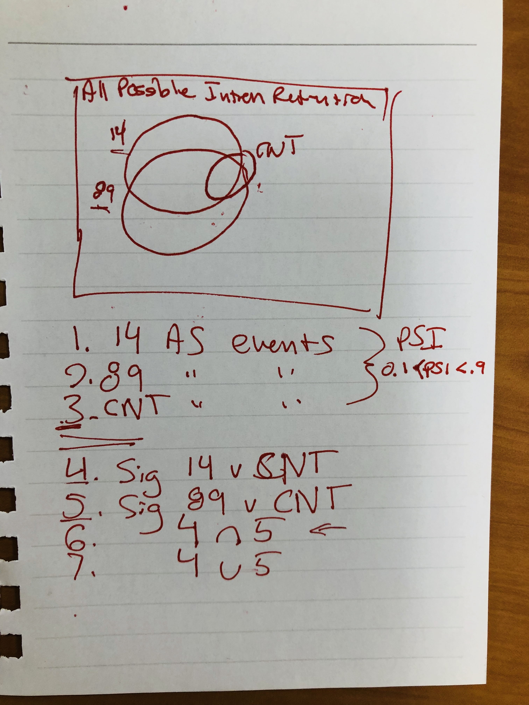

# Day 3

```{r setup, include=FALSE}
knitr::opts_chunk$set(echo = TRUE, message = F, warning = F)
library(tidyverse)
library(kableExtra)
```

```{r out.width=400}

```

```{r the first three}
# only looking at the individual PSI values and filter(the first three sets)
data_path <- '../../05_IRfinder/data/rawIRfinderResult/'
fns <- list.files(data_path, pattern = 'txt', full.names = T)

res <- fns %>%
  map(~ read_tsv(.,comment = '#',col_names = T)  %>%
        mutate(locus = paste(Chr,paste(Start, End, sep = '-'), sep = ':' ) ) %>%
        rename_all(funs(stringr::str_replace_all(., '-', '_') )) %>%
        separate(names(.)[4], into = c('Symbol', 'GeneID', 'Category'), sep = '/') %>%
        mutate(GeneID = str_replace_all(string = GeneID, pattern = '\\..*$', replacement = '')) %>%
        dplyr::select(locus, GeneID, A_IRratio, B_IRratio) %>%
        arrange(desc(B_IRratio))) 


# check if the B_IRratio are the same(should be)
look <- res[[1]] %>%
  inner_join(res[[2]], by = 'locus') %>%
  filter(B_IRratio.x != B_IRratio.y) %>%
  nrow
# ok they are the same
```

```{r}
# get the first three sets locus
set14 <- res[[1]] %>%
  filter(A_IRratio > 0.1 & A_IRratio < 0.9) %>%
  pull(locus)

set89 <- res[[2]] %>%
  filter(A_IRratio > 0.1 & A_IRratio < 0.9) %>%
  pull(locus)

setControl <- res[[2]] %>%
  filter(B_IRratio > 0.1 & B_IRratio < 0.9) %>%
  pull(locus)

list(set14 = set14, set89 = set89, setControl = setControl) %>%
  map_dfr(length) %>%
  kable() %>%
  kable_styling(full_width = F)
```

```{r}
# the other two sets
# get the sig events of 14 and 89
sig <- fns %>%
  map(~ read_tsv(.,comment = '#',col_names = T)  %>%
        mutate(locus = paste(Chr,paste(Start, End, sep = '-'), sep = ':' ) ) %>%
        rename_all(funs(stringr::str_replace_all(., '-', '_') )) %>%
        separate(names(.)[4], into = c('Symbol', 'GeneID', 'Category'), sep = '/') %>%
        mutate(GeneID = str_replace_all(string = GeneID, pattern = '\\..*$', replacement = ''),
               padj = p.adjust(p_diff, method = 'BH')) %>%
        filter(! Category == 'known-exon') %>%
        filter( A_IRok != 'MinorIsoform' &  B_IRok != 'MinorIsoform' ) %>%
        filter(padj < 0.05) 
        )

# how many of them left
sig %>%
  map_dfc(nrow) %>%
  rename(sig14 = names(.)[1],
         sig89 = names(.)[2]) %>%
  kable() %>%
  kable_styling(full_width = F)


```
```{r}
# extract the sig locus only
sig_locus <- sig %>%
  map(~ pull(.data = ., locus)) 

# get the intersection and union of the sig locus in the above 14 and 89
set_overlap <- intersect(sig_locus[[1]], sig_locus[[2]])

set_union <- union(sig_locus[[1]], sig_locus[[2]])

# make the numbers in to a df
list(set_overlap = set_overlap, set_union = set_union) %>%
  map_dfc(length)  %>%
  kable()  %>%
  kable_styling(full_width = F)
```

